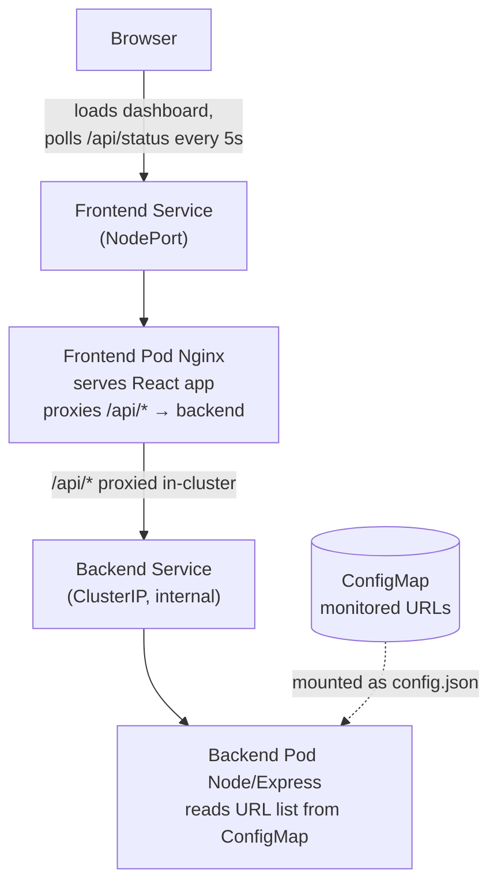

# Service Monitor
**Author:** Yousef Aldali 

A small full-stack app that monitors the availability of several websites/APIs
and shows their live status on a dashboard. Containerized with Docker and
deployed to a local Kubernetes cluster via minikube.

## Tech Stack

- **Backend: Node.js + Express.** Minimal, readable HTTP API framework. Node's
  built-in `fetch` and async model suit a service whose main job is making many
  outbound HTTP checks concurrently.
- **Frontend: React (Vite).** React renders a data-driven dashboard that updates
  from state as new data arrives. Vite produces clean static output that's simple
  to serve in production. JavaScript on both sides keeps the project consistent.
- **Deployment: Docker + Kubernetes (minikube).** Docker packages each component
  with its exact environment; Kubernetes runs and manages the containers; minikube
  runs the cluster locally.

## Architecture



**How they connect.** The frontend and backend don't talk directly. The browser
loads the dashboard from Nginx, then calls `/api/status`. Nginx serves the static
files and proxies `/api/*` to the backend service inside the cluster
(`http://backend:4000`). This gives the browser a single origin (no CORS needed in
the cluster) and lets the backend stay private (ClusterIP), reachable only through
the proxy.

**Monitoring.** The backend checks all configured URLs every 30 seconds. Checks
run concurrently via `Promise.all`, so one slow/unreachable URL doesn't block the
others. Each check records status (UP/DOWN), HTTP code, response time (ms), and a
timestamp. Outbound checks use a 10-second timeout via `AbortController`; timeouts
and unreachable hosts are caught and recorded as DOWN, so a failed check never
crashes the monitor.

**Storage.** In-memory: the latest snapshot plus a rolling history of the last 100
checks per service.

**Refresh.** The dashboard polls `/api/status` every 5 seconds.

**Configuration.** The monitored URL list lives in a Kubernetes ConfigMap, mounted
into the backend pod as `config.json`, so URLs can change without rebuilding the
image.

## Key Decisions considered alternatives 

- **Plain YAML over Helm/Kustomize.** For a project this size, plain manifests are
  the most transparent a reviewer can read exactly what's deployed. Helm's
  templating and packaging pay off with many services or multiple environments,
  which would be over-engineering here.

- **Nginx reverse proxy over exposing the backend directly.** I could have exposed
  the backend via its own NodePort and pointed the frontend at it, but that URL is
  environment-specific and fragile (and needs CORS). Proxying `/api` through the
  frontend's Nginx gives the browser a single origin, removes CORS, and keeps the
  backend private.

- **NodePort over Ingress/LoadBalancer.** NodePort is the simplest way to reach the
  app on local minikube. Ingress would be the production choice (real hostnames,
  TLS); LoadBalancer targets cloud providers, not local dev.

- **Express over raw Node / heavier frameworks.** Express gives clean routing with
  almost no boilerplate and is easy to explain; the raw `http` module would mean
  more manual work, and a larger framework would be unnecessary for a handful of
  endpoints.


- **In-memory store over a database.** Simple, no external dependency, fine for a
  demo. Tradeoff: data resets on restart and isn't shared across replicas a
  database would fix both in production.

- **Polling over WebSockets/SSE.** Data changes only every 30s, so polling every 5s
  is more than enough and far simpler than maintaining push connections.

## API

- `GET /status`: current status of all services
- `GET /history/:name`: history for one service (e.g. `/history/GitHub`)
- `GET /health`: health check (used by Kubernetes probes)

## Project Structure

```
service-monitor/
├── monitor-backend/    # Node/Express API + monitoring logic
│   ├── server.js
│   ├── config.json
│   └── Dockerfile
├── monitor-frontend/   # React (Vite) dashboard
│   ├── src/App.jsx
│   ├── nginx.conf      # serves app + proxies /api to backend
│   └── Dockerfile      # multi-stage: build with Node, serve with Nginx
└── k8s/                # Kubernetes manifests
    ├── backend-configmap.yaml
    ├── backend-deployment.yaml
    ├── backend-service.yaml
    ├── frontend-deployment.yaml
    └── frontend-service.yaml
```

## Setup & Run

**Prerequisites:** Docker, minikube, and kubectl installed.

```bash
# 1. Start the cluster
minikube start

# 2. Point your terminal's Docker at minikube (images must be built inside it)
eval $(minikube docker-env)

# 3. Build both images
docker build -t monitor-backend ./monitor-backend
docker build -t monitor-frontend ./monitor-frontend

# 4. Deploy
kubectl apply -f k8s/backend-configmap.yaml
kubectl apply -f k8s/backend-deployment.yaml
kubectl apply -f k8s/backend-service.yaml
kubectl apply -f k8s/frontend-deployment.yaml
kubectl apply -f k8s/frontend-service.yaml

# 5. Wait until ALL pods show Running before continuing
kubectl get pods

# 6. Open the dashboard (keep this terminal open — on macOS the tunnel
#    only stays alive while the command runs)
minikube service frontend --url
```

Open the printed URL in your browser to see the dashboard.

> **Windows note (step 2):** `eval $(minikube docker-env)` is for macOS/Linux
> (bash/zsh). In **Windows PowerShell**, use:
> ```powershell
> & minikube -p minikube docker-env --shell powershell | Invoke-Expression
> ```
> Alternatively, on any OS, build the images normally and load them into the
> cluster with `minikube image load monitor-backend` and
> `minikube image load monitor-frontend`.

## Improvements for Production

- Replace in-memory storage with a shared database so history persists and is
  shared across replicas.
- Use an Ingress with a real hostname (and TLS) instead of NodePort.
- Restrict CORS to the real frontend origin; manage secrets via Kubernetes Secrets.
- Real alerting (email/Slack) when a service goes down.
- CI/CD to automate image builds and deployment.

## Bonuses Implemented

- Response-time history chart per service (click any card to view).
- Kubernetes liveness & readiness probes on the backend via `/health`.
- Horizontal scaling  backend runs with 2 replicas.


